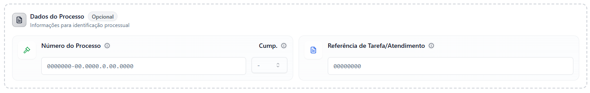
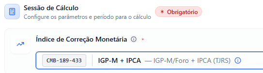
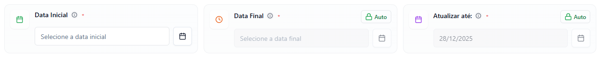
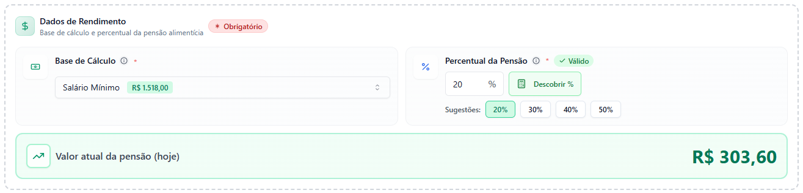
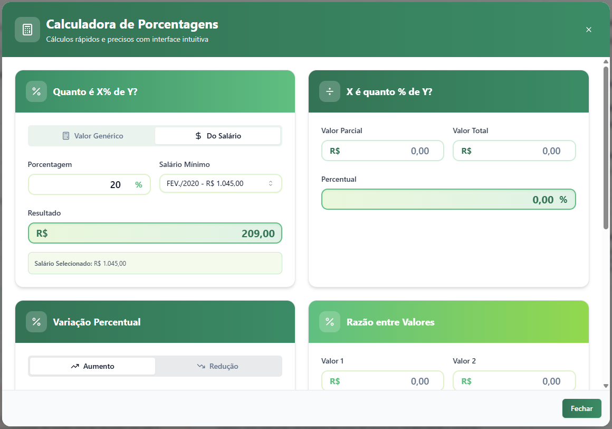

## Bem-vindo ao SICAD

O **SICAD (Sistema Integrado de Cálculos da Defensoria)** é uma ferramenta oficial desenvolvida pelo Setor de Cálculos da Defensoria Pública do Rio Grande do Sul para auxiliar em cálculos jurídicos e financeiros especializados.

## 📋 O que você aprenderá neste manual

Este guia completo irá orientá-lo através de todas as funcionalidades do SICAD:

<CardGroup cols={2}>
  <Card title="Introdução ao Sistema" icon="house">
    Conheça a interface e navegação básica
  </Card>
  <Card title="Introdução aos Módulos de Cálculos" icon="calculator">
    Guia detalhado dos principais serviços disponíveis (Calculadora de Pensão, Correção Monetária, Análise de Juros, etc.)
  </Card>
</CardGroup>

---

## 🏠 Introdução ao Sistema

### Acessando o SICAD

O sistema está disponível em ambiente de homologação. Você verá o indicador de ambiente no canto superior direito da tela.

### Navegação Principal

A interface do SICAD é organizada de forma intuitiva:

- **Menu Superior**: Acesso rápido aos principais serviços
- **Página Inicial**: Visão geral e acesso aos serviços em destaque
- **Catálogo de Serviços**: Lista completa de calculadoras disponíveis

### Serviços Disponíveis

O SICAD oferece atualmente **3 serviços ativos**:

1. **Pensão Alimentícia** - Cálculo com correção monetária automática
2. **Análise de Juros Abusivos** - Verificação de taxas de crédito
3. **Porcentagens** - Cálculos financeiros rápidos
4. **(Em Breve)** Correção Monetária - Ferramenta em desenvolvimento

---

## 🧮 Calculadora de Pensão Alimentícia

A Calculadora de Pensão Alimentícia é o serviço principal do SICAD, desenvolvida para automatizar cálculos complexos de acordo com a legislação vigente.

### Características Principais

<AccordionGroup>
  <Accordion title="Correção Monetária Automática">
    O sistema aplica índices oficiais (IGP-M/FORO + IPCA/IBGE, IPCA, INPC, IGP-M, IPCA-E) conforme definido pela jurisprudência do TJRS.
  </Accordion>
  
  <Accordion title="Cálculo de Juros Legais">
    Juros calculados automaticamente conforme Lei 14.905/2024, com taxa legal atualizada.
  </Accordion>
  
  <Accordion title="Relatórios em PDF">
    Gere demonstrativos prontos para anexar em processos judiciais.
  </Accordion>
  
  <Accordion title="Recálculo Rápido">
    Compartilhe links para recálculos instantâneos.
  </Accordion>
</AccordionGroup>

### Passo a Passo: Como Calcular Pensão Alimentícia

#### 1. Dados do Processo (Opcional)

Inicie preenchendo as informações processuais, se disponíveis:
- **Número do Processo**: CNJ no formato padrão
- **Cumprimento**: Selecione se é cumprimento de sentença (Art. 523) ou não (-)
- **Referência de Tarefa/Atendimento**: Código interno de identificação

<Tip>
  Esses campos são opcionais, mas ajudam na organização e rastreabilidade dos cálculos.
</Tip>

#### 2. Sessão de Cálculo (Obrigatório)

Configure os parâmetros essenciais do cálculo:

**Índice de Correção Monetária**
- Padrão: IGP-M/Foro + IPCA (TJRS) - CMB-189-433
- Outras opções: INPC, IPCA-E, apenas IGP-M, etc.

<Info>
  O índice conforme orientação do TJRS é o IGP-M/Foro + IPCA, identificado como CMB-189-433 no sistema.
</Info>

**Período do Cálculo**
- **Data Inicial**: Primeiro mês de incidência da pensão
- **Data Final**: Último mês a ser calculado (automático ou manual)
  - Por padrão, o sistema calcula automaticamente até o último vencimento com base na data inicial.
  - Clique no botão **"Auto"** para habilitar a edição manual e definir uma data específica
- **Atualizar até**: Data de cálculo (normalmente a data atual)
  - Clique no botão **"Auto"** para editar manualmente, se necessário

<Tip>
  Os campos com botão **"Auto"** calculam automaticamente as datas. Clique no botão para desativar o modo automático e inserir uma data específica.
</Tip>

<Warning>
  Certifique-se de que as datas estão corretas, pois afetam diretamente o resultado.
</Warning>

#### 3. Dados de Rendimento (Obrigatório)

Defina a base de cálculo e o percentual da pensão:

**Base de Cálculo**

Escolha entre:
- **Salário Mínimo**: O sistema aplica automaticamente todos os valores vigentes no período
- **Outros rendimentos**: Para valores fixos ou bases customizadas

<Info>
  Ao selecionar Salário Mínimo, o sistema atualiza automaticamente os valores conforme cada competência.
</Info>

**Percentual da Pensão**

Defina o percentual através de:
- **Digitação manual**: Digite diretamente o valor (ex: 20%)
- **Botões rápidos**: Clique em 20%, 30%, 40% ou 50%
- **Botão "Descobrir %"**: Calculadora reversa para descobrir o percentual quando você já sabe o valor desejado da pensão

<Tip>
  Ao clicar em "Descobrir %", abre-se um modal onde você pode calcular o percentual com base no valor de pensão desejado e o salário de referência.
</Tip>

#### 4. Tipo de Cálculo (Obrigatório)

Escolha o procedimento legal aplicável:

<Tabs>
  <Tab title="Prisão (Art. 528, CPC)">
    **Procedimento Coercitivo**
    
    Utilizado para execução das **últimas 3 prestações vencidas**, com possibilidade de prisão civil do devedor por até 3 meses.
    
    - Juros: Taxa Legal
    - Prazo: Últimas 3 parcelas
    - Finalidade: Coação pessoal
  </Tab>
  
  <Tab title="Penhora (Art. 523, CPC)">
    **Cumprimento de Sentença**
    
    Aplicado para execução de **prestações antigas**, com penhora de bens e aplicação de juros e correção monetária.
    
    - Juros: Taxa Legal (Lei 14.905/2024)
    - Prazo: Prestações anteriores às 3 últimas
    - Finalidade: Execução patrimonial
  </Tab>
</Tabs>

### Precisão nos Cálculos

<Warning>
  **Atenção**: O sistema utiliza índices oficiais atualizados automaticamente. Sempre verifique se está usando a versão mais recente do sistema.
</Warning>

### Quando Usar Cada Procedimento

| Situação | Procedimento | Base Legal |
|----------|--------------|------------|
| Últimas 3 parcelas | Prisão | Art. 528, CPC |
| Prestações antigas | Penhora | Art. 523, CPC |
| Cobrança urgente | Prisão | Art. 528, CPC |
| Acúmulo de dívidas | Penhora | Art. 523, CPC |

---

#### 5. Configurações do Cálculo

Ajuste parâmetros adicionais conforme necessário:

**Juros Moratórios**
- **Juros Legais**: Ativado por padrão (Lei 14.905/2024)
  - 0,5% até 10/01/2003
  - 1% até 29/08/2024
  - Taxa Legal após 30/08/2024
- **Valor Personalizado**: Bloqueado quando taxa legal está ativa

**Regras de Pagamento**
- **13º Salário**: Incluir no cálculo (se período incluir dezembro)
- **Vencimento Subsequente**: Parcelas vencem no mês seguinte à competência

**Pagamento**
- **QR Code PIX**: Incluir no demonstrativo (dados não armazenados - LGPD)

#### 6. Calcular e Visualizar Resultado

Após preencher todos os campos obrigatórios, clique em **"Calcular Pensão Alimentícia"**.

### Interpretando o Resultado

O resultado apresenta uma tabela detalhada com:

**Informações do Cabeçalho**
- Período calculado
- Base de cálculo e percentual
- Índice de correção aplicado
- Juros moratórios configurados

**Tabela de Parcelas**

Cada linha representa um mês e mostra:

| Coluna | Descrição |
|--------|-----------|
| **Mês** | Competência da parcela |
| **Venc.** | Data de vencimento |
| **Base** | Valor da base de cálculo |
| **%** | Percentual aplicado |
| **Pensão** | Valor original da pensão |
| **Pago** | Valor já pago (editável) |
| **Devido** | Saldo devedor |
| **Índice** | Fator de correção monetária |
| **Corrigido** | Valor corrigido |
| **Vl. Juros** | Juros moratórios |
| **Total** | Valor total a pagar |

**Totalizador**
- Total de Pensão Devida
- Total Pago
- Total Devido
- Total Corrigido
- Total de Juros
- **VALOR TOTAL A RECEBER**

<Tip>
  Linhas destacadas em **verde** indicam períodos pagos integralmente, em **laranja** pagamentos parciais, e em **branco** períodos não pagos.
</Tip>

### Consectários Legais

Antes de imprimir, selecione os acréscimos aplicáveis conforme Art. 523, § 1º do CPC:

- **Sem Multa e Sem Honorários**: Apenas correção e juros
- **Multa de 10%**: Não pagamento em 15 dias
- **Honorários Advocatícios de 10%**: Pagamento não voluntário

### Ações Disponíveis

<CardGroup cols={3}>
  <Card title="Compartilhar" icon="share-nodes">
    Gere um link para compartilhar o cálculo
  </Card>
  <Card title="Editar Cálculo" icon="pen-to-square">
    Volte ao formulário para ajustar parâmetros
  </Card>
  <Card title="Imprimir Relatório" icon="print">
    Gere PDF do demonstrativo (Ctrl+P)
  </Card>
</CardGroup>

<Info>
  **Atalho de Teclado**: Pressione **Ctrl + P** para imprimir ou salvar o relatório rapidamente.
</Info>

---

## 📊 Análise de Juros Abusivos

A ferramenta de Análise de Juros Abusivos permite verificar rapidamente se as taxas de juros cobradas em contratos de crédito estão acima dos limites estabelecidos pelo Banco Central.

### Como Usar

1. **Data de Contratação**: Selecione a data do contrato
2. **Taxa Mensal (%)**: Informe a taxa de juros mensal cobrada
3. **Modalidade de Crédito**: Escolha o tipo de crédito (ex: Crédito Pessoal, Cartão de Crédito, etc.)
4. Clique em **"Analisar Juros"**

<Note>
  O sistema compara a taxa informada com as médias históricas do BACEN para determinar se há indícios de abusividade.
</Note>

---

## 🆘 Suporte e Ajuda

### Canais de Atendimento

<CardGroup cols={2}>
  <Card title="Formulário de Suporte" icon="file-lines" href="https://linktr.ee/joao.ai">
    Acesse o formulário online para reportar problemas ou solicitar novos recursos
  </Card>
  
  <Card title="E-mail CATE/RS" icon="envelope">
    calculos@defensoria.rs.def.br
    
    Assunto: SICAD - Suporte
  </Card>
</CardGroup>

### Perguntas Frequentes (FAQ)

<AccordionGroup>
  <Accordion title="Como atualizar a base de cálculo?">
    O sistema atualiza automaticamente o valor do salário mínimo vigente. Para usar outro valor, selecione "Salário Customizado" no campo Base de Cálculo.
  </Accordion>
  
  <Accordion title="Posso editar valores já pagos?">
    Sim! Na tabela de resultados, clique no campo "Pago" de cada mês e informe o valor já quitado. O sistema recalculará automaticamente os totais.
  </Accordion>
  
  <Accordion title="O cálculo considera o 13º salário?">
    Sim, quando o período inclui dezembro, você pode ativar a opção "13º Salário" nas configurações do cálculo.
  </Accordion>
  
  <Accordion title="Como funcionam os juros legais?">
    Os juros seguem a Lei 14.905/2024:
    - 0,5% ao mês até 10/01/2003
    - 1% ao mês de 11/01/2003 até 29/08/2024
    - Taxa Legal (SELIC) após 30/08/2024
  </Accordion>
  
  <Accordion title="Posso salvar meus cálculos?">
    O sistema gera um link compartilhável para cada cálculo. Salve esse link para acessar o cálculo novamente ou compartilhá-lo com colegas.
  </Accordion>
</AccordionGroup>

### Recursos Adicionais

<CardGroup cols={3}>
  <Card title="Manual do SICAD" icon="book">
    Este documento completo
  </Card>
  
  <Card title="Termos de Uso" icon="file-contract">
    Condições e política de dados
  </Card>
  
  <Card title="Atualizações" icon="rocket">
    Novidades e melhorias recentes
  </Card>
</CardGroup>

---

## 📝 Informações do Sistema

### Versão Atual

**v1.2.2** (20/01/2026)
- Correção de bugs nas sessões de usuário
- Melhorias gerais no sistema

### Histórico de Atualizações

<Accordion title="Versões Anteriores">
  **v1.2.1** (12/12/2025)
  - Adição da Calculadora de Juros Abusivos
  - Melhorias gerais no sistema
  
  **v1.2.0** (03/12/2025)
  - Ajustes e padronizações com base em feedbacks
  - Relatórios oficiais implementados
  
  **v1.1.0** (15/11/2025)
  - Correções no cálculo de juros
  - Atualização monetária aprimorada
  
  **v1.0.1** (29/10/2025)
  - Aprimoramentos na interface
  
  **v1.0.0** (28/10/2025)
  - Lançamento do piloto: Calculadora de Pensão Alimentícia-DPERS
</Accordion>

### Estatísticas

- **Status do Sistema**: Online
- **Serviços Ativos**: 3
- **Total de Cálculos Realizados**: 125.847+
- **Usuários Ativos (30d)**: 100+

---

## 🎓 Conclusão

O SICAD é uma ferramenta poderosa que simplifica cálculos jurídicos complexos, garantindo precisão e padronização. 

<Check>
  **Você está pronto para usar o SICAD!** Em caso de dúvidas, consulte este manual ou entre em contato com o suporte.
</Check>

---

<Card
  title="Desenvolvido por"
  icon="building"
>
  **Setor de Cálculos (CATE-RS)**
  
  Defensoria Pública do Estado do Rio Grande do Sul
  
  📧 calculos@defensoria.rs.def.br
  
  🌐 www.defensoria.rs.def.br
</Card>
